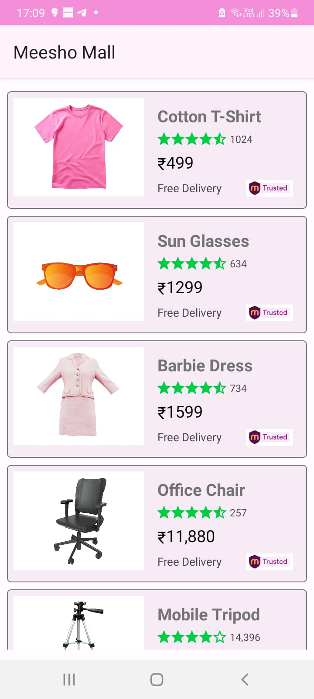

# Meesho Dice  
We developed an Android app using Augmented Reality (AR) for the **Meesho Dice Challenge**. This app was designed to improve the shopping experience as part of the challenge's problem statement.

Download app in .apk format [Download](https://drive.google.com/uc?export=download&id=13vgtv_LrfRiOdV2c1iCOHrJ6duQPgMgz)

## Problem Statement:
In traditional offline shopping, customers enjoy a tactile and immersive experience— they can feel the products, try them, and interact with store staff for guidance and recommendations. Online shopping lacks this tangible experience, but with advancements in technology, some aspects of offline shopping can now be recreated digitally.
The challenge is to create a platform or feature that enhances the online shopping experience by replicating key elements of offline shopping. This solution should offer users an interactive, engaging, and personalised online shopping journey that mirrors the physical store environment.

## Solution:
We aim to address these challenges by leveraging Augmented Reality (AR) technology, which will allow customers to interact with virtual representations of products. This will enable users to assess details such as size, fit, and color coordination. By offering the ability to virtually try products using their smartphones, we can significantly reduce the disconnect between customers and the physical items they wish to purchase.

## UI/UX:
We use the standard color scheme that Meesho follows and tried to incorporate the same in our app.

# Team Details:
**Team Name** : PSEUDOCODE

**Contributers**:
1. [Aditya Singh](https://www.linkedin.com/in/aditya-singh-95109b311/)
2. [Rishabh Jain](https://www.linkedin.com/in/awesome-rishabh-jain/)
3. [Shrujai Gupta](https://www.linkedin.com/in/shrujaigupta/)
